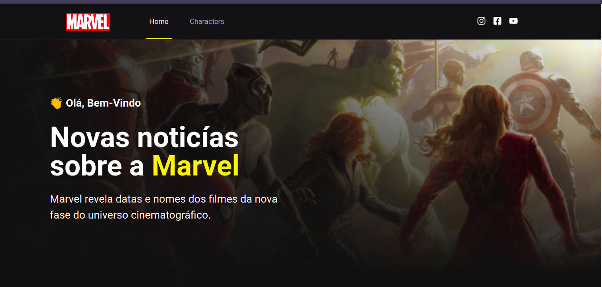

<h1 align="center">
  
</h1>

<h1 align="center">
  
</h1>

Já dizia o Homem Aranha <i>"Com grandes poderes,vem grandes responsabilidades".</i> Aplicação desenvolvida em <strong>React</strong> que consome API da Marvel.

#

### Features
- [x] Página Home
- [x] Página de personagens 

#

### Tecnologias
- [React](https://pt-br.reactjs.org/)
- [Scss](https://sass-lang.com/)

#

### Autor

 
<b>Elves Brito</b>

